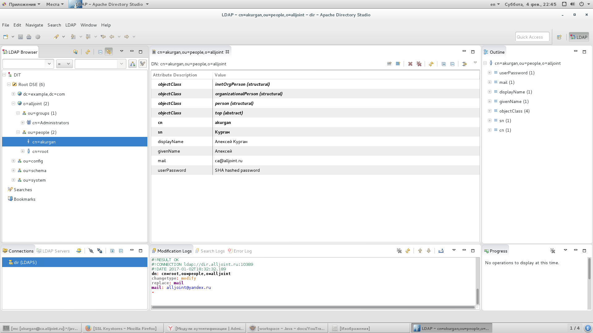

# Настройка аутентификации пользователей в JetBrains YouTrack через Apache Directory LDAP через SSL

Если необходимо настраиваем *SSL* для *Apache Directory*, достаточно подробная инструкция [здесь](http://directory.apache.org/apacheds/basic-ug/3.3-enabling-ssl.html "Инструкция по настройке SSL в Apache Directory").

*JetBrains YouTrack* для сопоставления пользователей *YouTrack* и пользователей *LDAP* использует email адреса, поэтому необходимо внимательно следить, чтобы пользователи *YouTrack*, как и пользователи *LDAP*, не имели совпадающих email адресов, то есть, чтобы у разных пользователей не было совпадающих email адресов.

Для настройки *YouTrack* LDAP модуля аутентификации использовалась вот эта [инструкция](https://www.jetbrains.com/help/hub/2.5/LDAP-Authentication-Module.html "Инструкция по настройке YouTrack LDAP"), но в ней написано не всё:

* импортируем в *YouTrack* то же хранилище ключей, что и в *Apache Directory*, пункт меню *YouTrack* ["Хранилища SSL-ключей"](https://www.jetbrains.com/help/youtrack/incloud/7.0/SSL-Key-Stores.html);
* через *Apache Directory Studio* экспортируем из хранилища *SSL* ключей *Apache Directory*, *DER* сертификат и импортируем его в *YouTrack*, пункт меню ["Доверенные SSL-сертификаты"](https://www.jetbrains.com/help/youtrack/incloud/7.0/SSL-Certificates.html);
* создаём модуль аутентификации со следующими параметрами:    
**Тип:** `LDAP`    
**URL-адрес сервера:** `ldaps://dir.alljoint.ru:10636/ou=people,o=alljoint`    
**DN подключения:** `cn=%u,ou=people,o=alljoint`    
**Фильтр:** `cn=%u`    
**Хранилище SSL-ключей:** *Импортированное нами хранилище SSL ключей*    
**Атрибуты LDAP|Имя:** `displayName`        
**Атрибуты LDAP|Логин:** `cn`    
**Атрибуты LDAP|Электронная почта:** `mail`    

Всё, вроде бы все должно работать и пользователи в *YouTrack* должны проходить аутентификацию через *LDAP*.

Данная инструкция полностью верна для случаю когда дерево *LDAP* организации выглядит так: 
